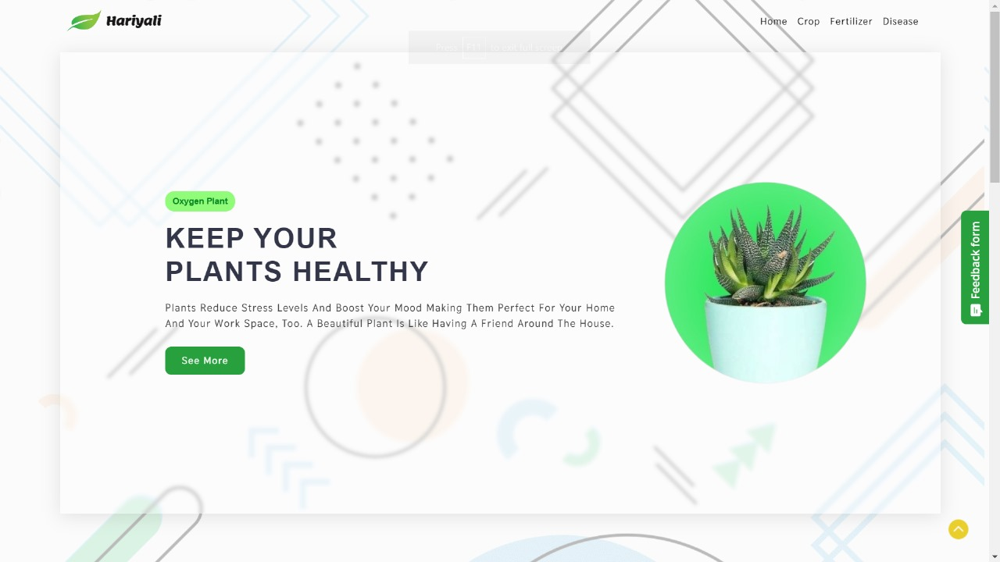
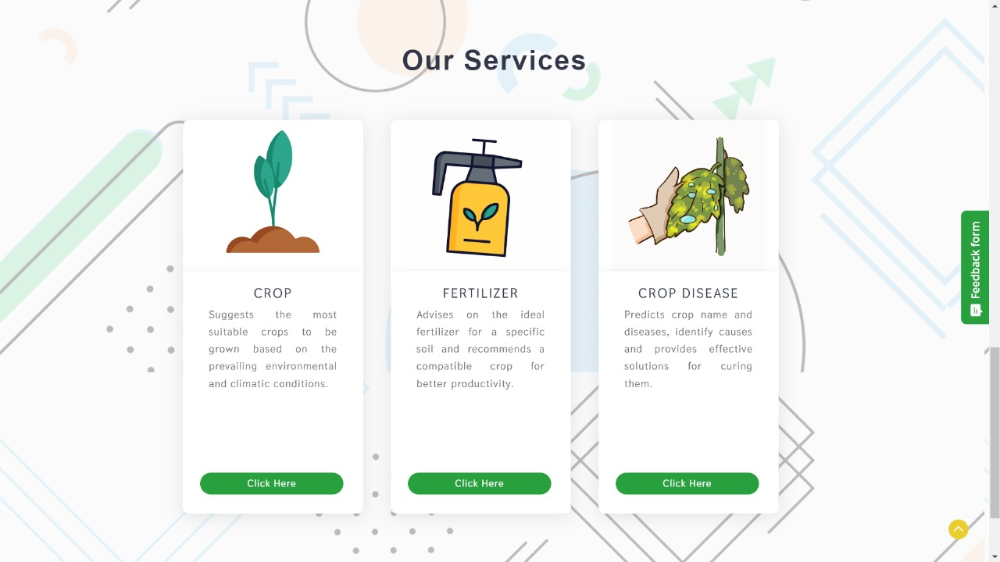
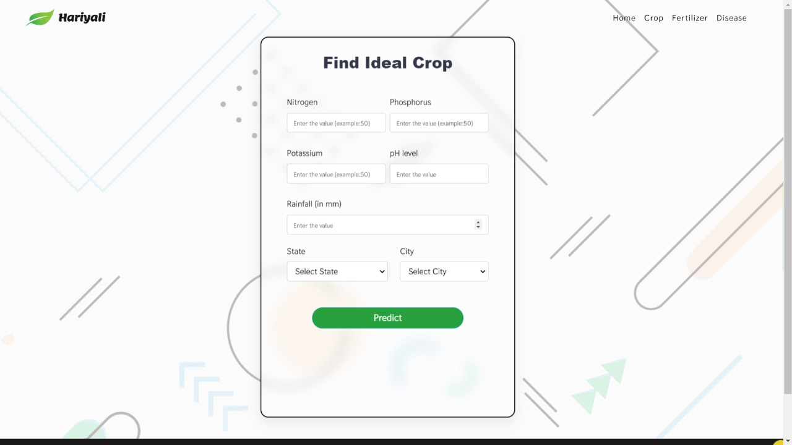
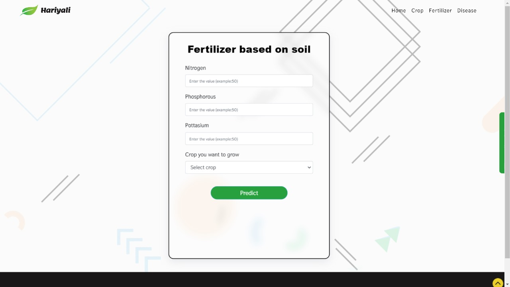
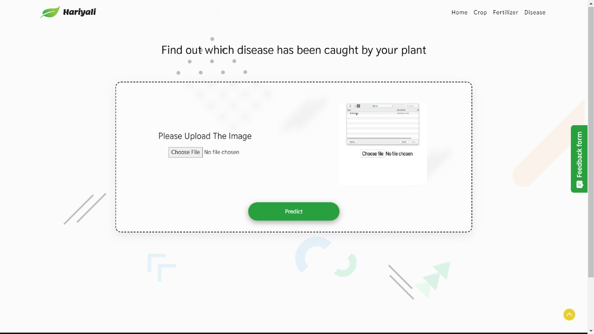

# 🍃Hariyali
<h3 style="text-align: center;">Using the potential of machine learning and deep learning in the agriculture industry.</h3>

## 🚀Inspiration
Farming in India is deeply ingrained in its cultural and economic fabric, with a significant portion of the population engaged in agriculture. The country's diverse agro-climatic zones allow for the cultivation of a wide variety of crops, ranging from rice and wheat to spices and fruits. Traditional farming practices coexist with modern agricultural techniques, reflecting the rich agricultural heritage.

Hariyali is a web application in which we employed advanced machine learning and deep learning technologies to assist you in navigating the entire farming process. Empower yourself to make well-informed decisions by delving into local demographics, gaining insights into factors influencing crops, and implementing strategies to ensure robust crop health, ultimately leading to increased yields.

Implementing predictive analytics can assist in anticipating and mitigating the impact of pests, diseases, and adverse weather conditions. Precision agriculture techniques, powered by machine learning algorithms, can tailor farming practices to specific microenvironments, optimizing water and fertilizer usage.

## 🤖What it does
Our Hariyali app leverages machine learning and deep learning technologies which holds immense potential for transforming India's agricultural sector. These advanced technologies can be instrumental in optimizing resource allocation, crop management, and decision-making processes. By analyzing vast datasets, it provides valuable insights into crop recommendation, crop disease detection and fertilizer suggestion on the basis of soil, enabling farmers to make informed choices for improved yield and resource efficiency.

## 💡Key features
#### 1️⃣ Crop Recommendation System
Make informed decisions about crop selection by leveraging our advanced recommendation system. Hariyali analyzes local conditions, climate data, and soil characteristics to suggest the most suitable crops for cultivation. Tailored to the respective conditions, this feature aims to maximize yields and promote sustainable farming practices.
> The N-P-K (Nitrogen - Phosphorous - Potassium) values to be entered should be in proper ratio. Refer the <a href="https://www.pennington.com/all-products/fertilizer/resources/understanding-fertilizer-labels">website</a> for more information.

> While entering the city name, make sure to enter common cities. Remote cities/towns may not be available in the Weather API from where data like temperature and humidity is fetched.

#### 2️⃣ Fertilizer Recommendation
Enhance soil fertility and crop health with our intelligent soil-fertilizer recommendation system. Hariyali assesses the specific soil composition, providing personalized suggestions for the best-suited fertilizers. Simultaneously, it recommends compatible crops, ensuring optimal nutrient utilization and promoting efficient farming practices.

#### 3️⃣ Crop Disease Prediction and Management
Prevent and manage crop diseases effectively with our predictive analytics feature. Hariyali employs machine learning to forecast potential diseases, identify causes, and offer actionable suggestions for effective management. Stay one step ahead, minimize losses, and foster a healthier crop yield.
> Supported crops - `Apple`, `Blueberry`, `Cherry`, `Corn`, `Grape`, `Pepper`, `Orange`, `Peach`, `Potato`, `Soybean`, `Strawberry`, `Tomato`, `Squash`, `Raspberry`

## 🗃️Tech Stack

## 🚝Future scope
Our commitment to innovation and sustainable farming practices drives the future evolution of Hariyali. Let's explore the exciting possibilities that lie ahead:
- <b>Enhanced Weather Forecasting</b> 
Empower farmers with accurate and timely weather forecasts tailored to their specific locations. Stay ahead of changing weather patterns, enabling proactive decision-making to mitigate risks and optimize farming practices.

- <b>Market Trends Analysis</b> 
Gain access to in-depth market trends analysis tools, helping farmers make strategic decisions based on real-time market dynamics. This feature aims to provide insights into pricing trends, demand patterns, and potential market opportunities.

- <b>Collaborative Tools for Farmers</b> 
Foster a sense of community and knowledge-sharing among farmers. Hariyali will introduce collaborative tools that enable farmers to connect, share insights, and learn from each other's experiences. This collaborative platform aims to create a supportive ecosystem for agricultural success.

## 🖼️Application Images
### 📌<b>Landing page</b> 
  
  
### 📌<b>Services</b> 
  

### 📌<b>Crop recommendation system</b> 
  
  
### 📌<b>Fertilizer recommendation</b> 
  
  
### 📌<b>Crop disease prediction</b> 
  

